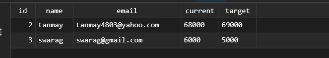

# Bitcoin-Alert-Application

## Introduction
This project is a Django-based web application designed to manage and send alerts when Bitcoin price target is achieved or is decreased to the lower limit. The solution includes endpoints for creating, reading, updating, and deleting alerts, and uses Docker for containerization.

## Project Structure and Architecture
The project follows a typical Django application structure with some additional files for Docker configuration:

- Bitcoin-Alert-Application
- │
- ├── my_app/
- │   ├── manage.py
- │   ├── my_app/
- │   │   ├── __init__.py
- │   │   ├── asgi.py
- │   │   ├── settings.py
- │   │   ├── urls.py
- │   │   └── wsgi.py
- │   ├── alerts/
- │   │   ├── migrations/
- │   │   ├── __init__.py
- │   │   ├── admin.py
- │   │   ├── apps.py
- │   │   ├── models.py
- │   │   ├── serializers.py
- │   │   ├── tests.py
- │   │   └── views.py
- │   └── management/
- │       └── commands/
- │           └── bitcoin.py
- │
- ├── Dockerfile
- ├── docker-compose.yml
- └── requirements.txt

### Key Components:
- **Django Project (`my_app`)**: Contains the main Django configuration files.
- **Alerts App**: Handles the core functionality of creating and managing alerts.
- **Management Commands**: Contains custom Django management commands, including the Bitcoin alert trigger script.
- **Docker Configuration**: Includes `Dockerfile` and `docker-compose.yml` for containerization.

### Architecture:
- The application follows a microservices architecture, with the Django app and PostgreSQL database running in separate containers.
- RESTful API endpoints are implemented using Django Rest Framework.
- The alert trigger script runs as a separate process, periodically checking Bitcoin prices and sending alerts when conditions are met.

## Prerequisites
- Docker
- Postman (for testing the API endpoints)
- TablePlus (for testing the PostgreSQL database)

## Steps to Run the Project

1. **Clone the Repository**
    ```sh
    git clone https://github.com/Tanmay4803/Bitcoin-Alert-Application.git
    cd Bitcoin-Alert-Application
    ```

2. **Navigate to the Project Directory**
    ```sh
    cd my_app
    ```

3. **Remove Any Previous Database**
    ```sh
    docker compose down -v
    ```

4. **Start the Database Container**
    ```sh
    docker compose up -d db
    ```

5. **Build the Django Application**
    ```sh
    docker compose build djangoapp
    ```

6. **Start the Django Application**
    ```sh
    docker compose up djangoapp
    ```

The server will be running on `localhost` at port `8000`.


## API Endpoints

### Create an Alert
- **URL:** `localhost:8000/alerts/create/`
- **Method:** POST
- **Example Request Body:**
    ```json
    {
        "name": "tanmay saxena",
        "email": "tanmay4803@gmail.com",
        "current": "68000",
        "target": "67000"
    }
    ```


### Read All Alerts
- **URL:** `localhost:8000/alerts/readall/`
- **Method:** GET

### Read a Specific Alert
- **URL:** `localhost:8000/alerts/read/<str:pk>`
- **Method:** GET

### Update an Alert
- **URL:** `localhost:8000/alerts/update/<str:pk>`
- **Method:** PUT
- **Example Request Body:**
    ```json
    {
        "name": "updated name",
        "email": "updatedemail@gmail.com",
        "current": "69000",
        "target": "68000"
    }
    ```


### Delete an Alert
- **URL:** `localhost:8000/alerts/delete/<str:pk>`
- **Method:** DELETE


## Database Configuration

The application uses PostgreSQL as its database. The configuration details are:
- **Host:** `localhost`
- **Port:** `5432`
- **User:** `postgres`
- **Password:** `postgres`
- **Database:** `postgres`


You can connect to the database using TablePlus or any other database client with the above details.

## PostgreSQL Database 



## Running the Alert Trigger Script

There is a Python script located at `management/commands/bitcoin.py` that can be run to see the trigger alerts. 

### Steps to Run the Script

1. Open the terminal in VS Code.
2. Navigate to the project directory.
3. Run the following command:
    ```sh
    python manage.py bitcoin
    ```

The output of the script execution can be observed in the VS Code terminal. A screenshot of the output is attached for reference.


